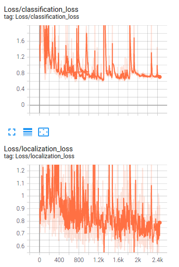
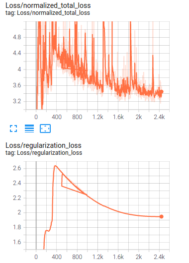

# Object Detection in an Urban Environment


## Table of Contents

1. [Project Description](#description)
2. [Getting Started](#getting_started)
   1. [Dependencies](#dependencies)
   2. [Installation](#installation)
   3. [Execution & Instruction](#execution)


<a name="descripton"></a>
## Description

This Project is part of Data Science Nanodegree Program by Bosch and Udacity. The goal of the project is to deploy a model with different hyperparameters and augmentations to train a neural network for detecting and classifying objects which is one of the crucial subject in autonomous driving. This deployment is done using tensorflow object detection API for detecting 3 classes of vehicles, pedestrians and cyclists.

This project is divided in the following sections:

## File Description
~~~~~~~
        object-detection-in-an-urban-environment
        |-- data                                            
                |-- test
                |-- val
                |-- train
        |-- examples                                        # example urban images containing their bounding boxes
                |-- training
                |-- tesing
                |-- validating
        |-- experiments
                |-- exporter_main_v2.py                     # tool for exporting object detection inference
                |-- label_map.pbtxt                         # label of the classes
                |-- model_main_tf2.py                       # model for launching a training
                |-- reference
                        |-- experiment0
                                |-- pipeline_new.config     # api config for 1st run
                        |-- experiment1
                                |-- pipeline.config         # api config for 2nd run              
                        |-- exported
                                |-- saved_model
                                        |-- saved_model.pb  # tensorflow SavedModel format
                                |-- pipeline.config
        |-- edit_config.py
        |-- Exploratory Data Analysis.ipynb                 # notebook for exploring the data
        |-- Explore augmentations.ipynb                     # augmentation notebook for exploring optimal required augmentations
        |-- filenames.txt
        |-- inference_video.py
        |-- launch_jupyter_tensorboard.sh                   # scripts for running the config and notebook files from linux in classroom environment
        |-- requirements.txt
        |-- utils.py
        |-- README.md
~~~~~~~

## Data

The dataset presented in this project is from [Waymo Open dataset](https://waymo.com/open/) and contains of urban environments images.

[OPTIONAL] - The files can be downloaded directly from the website as tar files or from the [Google Cloud Bucket](https://console.cloud.google.com/storage/browser/waymo_open_dataset_v_1_2_0_individual_files/) as individual tf records. We have already provided the data required to finish this project in the workspace, so you don't need to download it separately.

These images then will be used for training, validation and testing and they are located in below:
```
data\train: which contains of 86 tfrecorf files
data\val: which has 10 tfrecord files
data\test: which contains of 3 tfrecord files
```

<a name="getting_started"></a>
## Getting Started


<a name="dependencies"></a>
### Dependencies
* Python 3.8+
* Visualization: matplotlib
* Model training: tensorflow

<a name="installation"></a>
### Installation
To clone the git repository:
```
git clone https://github.com/uslumt/nd013-c1-vision-starter
```

#### Classroom Workspace

In the classroom workspace all the the necessary packages and libraries are already installed in the environment. Additionally, data required for this project is also already provided.

**Note** This project contains of 2 jupyter notebooks. Launching these notebooks can only be done with the Desktop workspace. To do so, you are required to open the terminal of your Desktop workspace and follow the below commands:
```
cd /home/workspace
jupyter notebook --port 3002 --ip=0.0.0.0 --allow-root
```
Alternatively you can run `./launch_jupyter.sh` in the workspace directory.


<a name="execution"></a>
### Execution and Instructions:

Following steps should be taken into account in order to run and complete the project.

#### Step 1:: Exploratory Data Analysis (EDA)
Exploring the dataset can be accomplished in this jupyter notebook. By displaying the images, we can get an overall picture about the data available in `data\` folder. Another task that we are having in this notebook is to create color-coded bounding boxes and annotate them for each class object using `matplotlib` library. In this work, red correspondent to vehicles, blue to pedestrians and green for cyclist class.

<p float="left">
  
  
  
</p>


As can be seen in the images above, these dataset contains of various weather conditions (rainy, foggy, sunny, cloudy), different places (autobahn, city, main street, one way street and etc.) and different time zones (day, night, midday). 
Some random images from train and validation dataset are saved in folder `examples\training`, `examples\testing` and `examples\validating`.

#### Step 2: download the pretrained model and edit the config file.

For this project, we are using Single Shot Detector (SSD) ResNet 50 640x640 model. Therefore, we need to download the pretrained model.

First, we need to change the directory.

```
cd /home/workspace/experiments/pretrained_model/
```

Then, by running the commands below, the pretrained SSD model can be downloaded.

```
wget http://download.tensorflow.org/models/object_detection/tf2/20200711/ssd_resnet50_v1_fpn_640x640_coco17_tpu-8.tar.gz

tar -xvzf ssd_resnet50_v1_fpn_640x640_coco17_tpu-8.tar.gz

rm -rf ssd_resnet50_v1_fpn_640x640_coco17_tpu-8.tar.gz

```
#### Step3: Training
The first training can be launch by the following command:
```
python experiments/model_main_tf2.py --model_dir=experiments/reference/experiment0/ --pipeline_config_path=experiments/reference/experiment0/pipeline_new.config
```
Once the training is done, you can launch the evaluation. Due to limitation in workspace storage, the evaluation scripts ran for just one epoch.

```
python experiments/model_main_tf2.py --model_dir=experiments/reference/experiment0/ --pipeline_config_path=experiments/reference/experiment0/pipeline_new.config --checkpoint_dir=experiments/reference/experiment0/
```


By using tensorboard the training as well as evaluation process can be monitored. By using the below command and copying the address in your web browser, you can see the trends.

```
python -m tensorboard.main --logdir experiments/reference/experiment_1/
```


In the image above, the loss trend of the training is shown.
as it can be seen that the model has high training loss and it means it is too simple (underfit), In order to improve the model performance, we can increase the epoch numbers and as the chance of overfitting might increase then it is suggested to add some augmentations or apply suitable augmentation methods available in  `preprocessor.proto` from Tf object detection API, we will work on the provided jupyter notebook `Explore augmentations.ipynb`.

Augmentation techniques used:
+ random_adjust_brightness with max_delta: 0.35
+ NormalizeImage with original_minval = 2, original_maxval = 3, target_minval = 4 target_maxval = 2 

After retraining with augmented data, it can be seen that the loss significantly decreased.





## Note: In the second experiment run, there is a feedback like a line because during training the device run out of storage and it had to interapt the training at the step number 506.
